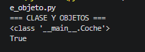
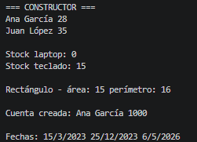
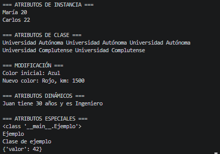
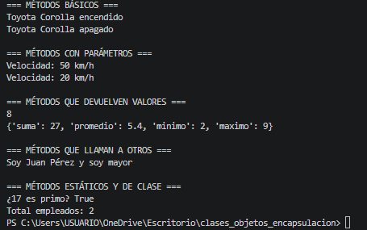
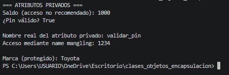
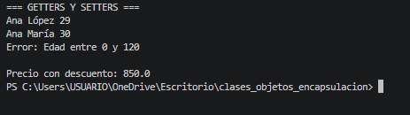
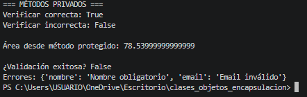
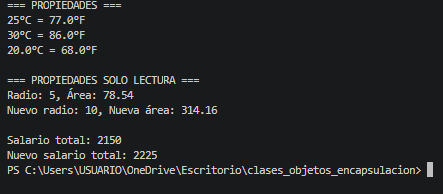

# Ejemplos replicados – Concepto de clase y objeto

Esta carpeta contiene la implementación práctica de los conceptos teóricos sobre **clases, objetos, constructor, atributos y métodos** vistos en el material de formación.

## Archivos incluidos

1. `clase_objeto.py` – Definición de clase vacía, creación de objetos, verificación con `type()` e `isinstance()`.
2. `constructor.py` – Uso de `__init__`, parámetros opcionales, validaciones, constructores alternativos con `@classmethod`.
3. `atributos.py` – Atributos de instancia, atributos de clase, atributos dinámicos y atributos especiales.
4. `metodos.py` – Métodos de instancia, métodos con parámetros, métodos que devuelven valores, métodos que llaman a otros métodos, métodos estáticos y de clase.

---

## 1. clase_objeto.py

**Propósito:**  
Mostrar la definición de una clase vacía y la creación de múltiples objetos (instancias), además de verificar su tipo.

**Código:**

```python
class Coche:
    """Clase que representa un coche"""
    pass

mi_coche = Coche()
coche_de_amigo = Coche()

print(type(mi_coche))
print(isinstance(mi_coche, Coche))
```

## Salida esperada:


### Explicación:

- type(mi_coche) devuelve la clase a la que pertenece el objeto mi_coche. Como se creó a partir de la clase Coche definida en el módulo __main__, la salida es <class '__main__.Coche'>.

- isinstance(mi_coche, Coche) verifica si mi_coche es una instancia de la clase Coche. Como lo es, devuelve True. Esto confirma la relación clase-objeto.


## 2. constructor.py
**Propósito:**
Demostrar el método constructor __init__, inicialización de atributos, valores predeterminados, validaciones y constructores alternativos.

**Código:**

```python
class Persona:
    def __init__(self, nombre, edad):
        self.nombre = nombre
        self.edad = edad

ana = Persona("Ana García", 28)
print(ana.nombre, ana.edad)

class Producto:
    def __init__(self, nombre, precio, stock=0):
        self.nombre = nombre
        self.precio = precio
        self.stock = stock

laptop = Producto("Laptop XPS", 1200)
print(laptop.stock)

class Rectangulo:
    def __init__(self, ancho, alto):
        self.ancho = ancho
        self.alto = alto
        self.area = ancho * alto

rect = Rectangulo(5, 3)
print(rect.area)

class Fecha:
    def __init__(self, dia, mes, año):
        self.dia = dia; self.mes = mes; self.año = año
    @classmethod
    def desde_texto(cls, texto):
        d,m,a = map(int, texto.split('-'))
        return cls(d,m,a)

f = Fecha.desde_texto("25-12-2023")
print(f"{f.dia}/{f.mes}/{f.año}")
```

## Salida esperada:


### Explicación:

- Persona("Ana García", 28) ejecuta __init__ asignando nombre y edad. print(ana.nombre, ana.edad) muestra Ana García 28.

- Producto("Laptop XPS", 1200) usa el valor predeterminado stock=0. Por eso imprime 0.

- Rectangulo(5, 3) calcula area = 5 * 3 = 15 dentro del constructor. Se imprime 15.

- Fecha.desde_texto("25-12-2023") es un método de clase que parsea el texto y crea una instancia. print muestra 25/12/2023.

## 3. atributos.py
**Propósito:**
Diferenciar entre atributos de instancia y de clase, mostrar atributos dinámicos y especiales.

**Código:**

```python
class Estudiante:
    universidad = "Universidad Autónoma"   # atributo de clase
    def __init__(self, nombre, edad):
        self.nombre = nombre               # atributo de instancia
        self.edad = edad

e1 = Estudiante("María", 20)
e2 = Estudiante("Carlos", 22)
print(e1.nombre, e1.universidad)
print(e2.nombre, e2.universidad)

Estudiante.universidad = "Universidad Complutense"
print(e1.universidad)

# Atributos dinámicos
juan = Estudiante("Juan", 25)
juan.profesion = "Ingeniero"
print(juan.profesion)

# Atributos especiales
print(e1.__dict__)
```
## Salida esperada:


### Explicación:

- e1.universidad y e2.universidad inicialmente devuelven "Universidad Autónoma" porque es un atributo de clase compartido.

- Al cambiar Estudiante.universidad = "Universidad Complutense" se modifica para todas las instancias, así e1.universidad ahora es "Universidad Complutense".

- A juan se le asigna dinámicamente el atributo profesion, por eso se imprime "Ingeniero".

- e1.__dict__ muestra los atributos de instancia de e1: {'nombre': 'María', 'edad': 20}. El atributo de clase no aparece aquí.

## 4. metodos.py
**Propósito:**
Mostrar métodos de instancia, estáticos y de clase, incluyendo métodos que llaman a otros métodos.

**Código:**

```python
class Calculadora:
    @staticmethod
    def es_par(n):
        return n % 2 == 0

    @classmethod
    def descripcion(cls):
        return f"Clase {cls.__name__}"

    def __init__(self, valor):
        self.valor = valor

    def doble(self):
        return self.valor * 2

print(Calculadora.es_par(10))
print(Calculadora.descripcion())
calc = Calculadora(5)
print(calc.doble())
```

## Salida esperada:


### Explicación:

- Calculadora.es_par(10) es un método estático. No necesita instancia y devuelve True porque 10 es par.

- Calculadora.descripcion() es un método de clase. Recibe cls y devuelve el nombre de la clase: "Clase Calculadora".

- calc = Calculadora(5) crea una instancia. calc.doble() multiplica el atributo valor (5) por 2, dando 10.

---

# Ejemplos replicados – Encapsulación

Esta carpeta contiene la implementación práctica de los conceptos de **encapsulación** vistos en el material de formación: atributos privados, getters/setters, propiedades y métodos privados.

## Archivos incluidos

1. `atributos_privados.py` – Atributos protegidos (`_`) y privados (`__`), name mangling, herencia.
2. `getters_setters.py` – Métodos tradicionales `get_` / `set_` con validación.
3. `propiedades.py` – Uso de `@property`, setter, propiedades de solo lectura y calculadas.
4. `metodos_privados.py` – Métodos privados (`__metodo`) y protegidos (`_metodo`), herencia.

---

## 1. atributos_privados.py

**Propósito:**  
Mostrar la convención de un guion bajo para atributos protegidos, doble guion bajo para atributos privados (name mangling), y cómo se comportan en herencia.

**Código:**

```python
class CuentaBancaria:
    def __init__(self, titular, saldo_inicial, pin):
        self._titular = titular          # protegido (convención)
        self._saldo = saldo_inicial      # protegido
        self.__pin = pin                 # privado (name mangling)

    def depositar(self, cantidad):
        if cantidad > 0:
            self._saldo += cantidad
            return True
        return False

    def validar_pin(self, pin_ingresado):
        return self.__pin == pin_ingresado

cuenta = CuentaBancaria("Ana García", 1000, "1234")
print("=== ATRIBUTOS PRIVADOS ===")
print("Saldo (acceso no recomendado):", cuenta._saldo)
# print(cuenta.__pin)  # AttributeError
print("¿Pin válido?", cuenta.validar_pin("1234"))
print()

# Ejemplo de name mangling
print("Nombre real del atributo privado:", dir(cuenta)[-1])  # _CuentaBancaria__pin
print("Acceso mediante name mangling:", cuenta._CuentaBancaria__pin)
print()

# Atributos protegidos en herencia
class Vehiculo:
    def __init__(self, marca, modelo):
        self._marca = marca      # protegido
        self.__modelo = modelo   # privado

class Coche(Vehiculo):
    def __init__(self, marca, modelo, puertas):
        super().__init__(marca, modelo)
        self._puertas = puertas
    def info(self):
        print("Marca (protegido):", self._marca)
        # print(self.__modelo)  # error

v = Coche("Toyota", "Corolla", 4)
v.info()
```
## Salida esperada:


### Explicación:

- cuenta._saldo → acceso a atributo protegido (posible pero no recomendado).

- validar_pin() → compara __pin (1234) con el ingresado, da True.

- dir(cuenta)[-1] → muestra el nombre interno del atributo privado (_CuentaBancaria__pin).

- cuenta._CuentaBancaria__pin → acceso forzado (name mangling) muestra 1234.

- v.info() → hereda _marca (protegido) y puede leerlo; __modelo es privado y no accesible.

## 2. getters_setters.py

**Propósito:**
Implementar getters y setters tradicionales para controlar el acceso a atributos con validaciones, y un ejemplo práctico con descuento.

**Código:**

```python
class Persona:
    def __init__(self, nombre, edad):
        self._nombre = nombre
        self._edad = edad

    def get_nombre(self):
        return self._nombre

    def set_nombre(self, nuevo_nombre):
        if isinstance(nuevo_nombre, str) and len(nuevo_nombre) > 0:
            self._nombre = nuevo_nombre
        else:
            raise ValueError("Nombre no válido")

    def get_edad(self):
        return self._edad

    def set_edad(self, nueva_edad):
        if isinstance(nueva_edad, int) and 0 <= nueva_edad <= 120:
            self._edad = nueva_edad
        else:
            raise ValueError("Edad entre 0 y 120")

print("=== GETTERS Y SETTERS ===")
ana = Persona("Ana López", 29)
print(ana.get_nombre(), ana.get_edad())
ana.set_nombre("Ana María")
ana.set_edad(30)
print(ana.get_nombre(), ana.get_edad())
try:
    ana.set_edad(-5)
except ValueError as e:
    print("Error:", e)
print()

# Ejemplo práctico con Producto
class Producto:
    def __init__(self, nombre, precio, stock=0):
        self._nombre = nombre
        self._precio = precio
        self._stock = stock
        self._descuento = 0

    def get_precio(self):
        return self._precio * (1 - self._descuento)

    def set_precio(self, nuevo_precio):
        if nuevo_precio < 0:
            raise ValueError("Precio no negativo")
        self._precio = nuevo_precio

    def set_descuento(self, desc):
        if 0 <= desc <= 1:
            self._descuento = desc

prod = Producto("Laptop", 1000, 10)
prod.set_descuento(0.15)
print("Precio con descuento:", prod.get_precio())
```

## Salida esperada:


### Explicación:

- Los getters devuelven valores iniciales Ana López 29.

- Los setters modifican nombre y edad a Ana María 30.

- Intentar edad -5 lanza error Edad entre 0 y 120.

- En Producto, set_descuento(0.15) aplica 15% de descuento, get_precio() devuelve 1000 * 0.85 = 850.0


## 4. metodos_privados.py

**Propósito:**
Demostrar métodos privados (__metodo) y protegidos (_metodo), y su uso en herencia y validación.

**Código:**

```python
class Autenticador:
    def __init__(self, usuario, contraseña):
        self._usuario = usuario
        self._hash = self.__generar_hash(contraseña)

    def __generar_hash(self, contraseña):
        import hashlib
        return hashlib.sha256(contraseña.encode()).hexdigest()

    def verificar(self, contraseña):
        return self.__generar_hash(contraseña) == self._hash

auth = Autenticador("admin", "1234")
print("=== MÉTODOS PRIVADOS ===")
print("Verificar correcta:", auth.verificar("1234"))
print("Verificar incorrecta:", auth.verificar("wrong"))
# print(auth.__generar_hash("test"))  # AttributeError
print()

# Métodos protegidos para herencia
class Forma:
    def calcular_area(self):
        return self._obtener_area()

    def _obtener_area(self):
        raise NotImplementedError("Implementar en subclase")

class Circulo(Forma):
    def __init__(self, radio):
        self._radio = radio
    def _obtener_area(self):
        return 3.1416 * self._radio ** 2

c = Circulo(5)
print("Área desde método protegido:", c.calcular_area())
print()

# Validación con métodos privados (Formulario)
class Formulario:
    def __init__(self):
        self._errores = {}

    def validar(self, datos):
        self._errores = {}
        self.__validar_campos_requeridos(datos)
        self.__validar_email(datos)
        return len(self._errores) == 0

    def __validar_campos_requeridos(self, datos):
        if "nombre" not in datos or not datos["nombre"]:
            self._errores["nombre"] = "Nombre obligatorio"

    def __validar_email(self, datos):
        if "email" in datos and "@" not in datos["email"]:
            self._errores["email"] = "Email inválido"

    def obtener_errores(self):
        return self._errores

f = Formulario()
datos = {"nombre": "", "email": "test"}
print("¿Validación exitosa?", f.validar(datos))
print("Errores:", f.obtener_errores())
```
## Salida esperada:


### Explicación:

- auth.verificar("1234") → compara el hash de "1234" con el guardado (coinciden) → True.

- auth.verificar("wrong") → el hash no coincide → False.

- c.calcular_area() → métodos protegidos: calcular_area() llama a _obtener_area() implementado en Circulo → área = 3.1416 * 25 = 78.54.

- f.validar() → llama a los métodos privados __validar_campos_requeridos y __validar_email. Como nombre está vacío y email no tiene "@", se registran errores. La validación falla (False) y se muestran los errores.

## 3. propiedades.py

**Propósito:**
Demostrar el uso de propiedades con @property, incluyendo setters, propiedades de solo lectura y calculadas.

**Código:**

```python
class Temperatura:
    def __init__(self, celsius=0):
        self._celsius = celsius

    @property
    def celsius(self):
        return self._celsius

    @celsius.setter
    def celsius(self, valor):
        if valor < -273.15:
            raise ValueError("Menor que cero absoluto")
        self._celsius = valor

    @property
    def fahrenheit(self):
        return self._celsius * 9/5 + 32

    @fahrenheit.setter
    def fahrenheit(self, valor):
        c = (valor - 32) * 5/9
        if c < -273.15:
            raise ValueError("Menor que cero absoluto")
        self._celsius = c

temp = Temperatura(25)
print("=== PROPIEDADES ===")
print(f"{temp.celsius}°C = {temp.fahrenheit}°F")
temp.celsius = 30
print(f"{temp.celsius}°C = {temp.fahrenheit}°F")
temp.fahrenheit = 68
print(f"{temp.celsius}°C = {temp.fahrenheit}°F")
print()

# Propiedad de solo lectura (Círculo)
import math
class Circulo:
    def __init__(self, radio):
        self._radio = radio

    @property
    def radio(self):
        return self._radio

    @radio.setter
    def radio(self, valor):
        if valor <= 0:
            raise ValueError("Radio positivo")
        self._radio = valor

    @property
    def area(self):
        return math.pi * self._radio ** 2

    @property
    def perimetro(self):
        return 2 * math.pi * self._radio

c = Circulo(5)
print("=== PROPIEDADES SOLO LECTURA ===")
print(f"Radio: {c.radio}, Área: {c.area:.2f}")
c.radio = 10
print(f"Nuevo radio: {c.radio}, Nueva área: {c.area:.2f}")
# c.area = 100  # AttributeError
print()

# Propiedad calculada (Empleado)
class Empleado:
    def __init__(self, nombre, salario_base, horas_extra=0, tarifa_extra=0):
        self._nombre = nombre
        self._salario_base = salario_base
        self._horas_extra = horas_extra
        self._tarifa_extra = tarifa_extra

    @property
    def salario_total(self):
        return self._salario_base + self._horas_extra * self._tarifa_extra

    @property
    def horas_extra(self):
        return self._horas_extra

    @horas_extra.setter
    def horas_extra(self, valor):
        self._horas_extra = valor

e = Empleado("Laura", 2000, 10, 15)
print("Salario total:", e.salario_total)
e.horas_extra = 15
print("Nuevo salario total:", e.salario_total)
```

## Salida esperada:


### Explicación:

- temp.celsius = 30 asigna temperatura en Celsius; temp.fahrenheit se recalcula a 86.0.

- temp.fahrenheit = 68 asigna valor en Fahrenheit, convierte a Celsius (20.0) y actualiza.

- c.radio es propiedad con setter; c.area y c.perimetro son solo lectura. Al cambiar radio de 5 a 10, el área se actualiza automáticamente.

- Empleado.salario_total es propiedad calculada: 2000 + (horas_extra × tarifa_extra). Al cambiar horas_extra de 10 a 15, el salario total pasa de 2150 a 2225.